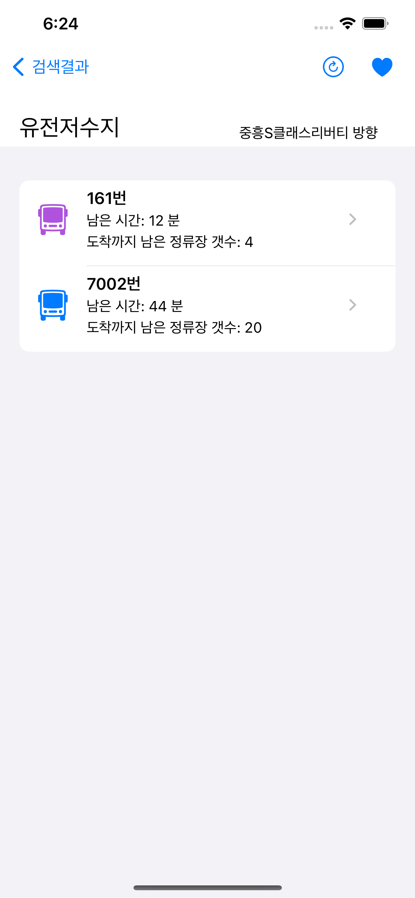
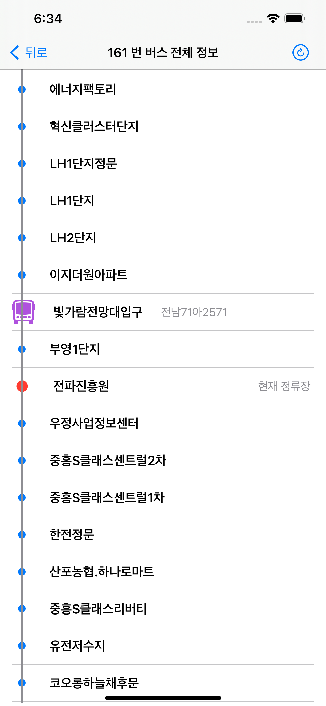

   

   
 # 
나주시 버스 

   
   

 

# 나주시 버스(Naju-si Bus)
나주시 시민들을 위한 버스 도착 정보를 제공하는 어플로써 버스 정류장을 검색하고 버스 도착까지 남은 시간을 알려주는 기능을 제공합니다.

## App Store

https://apps.apple.com/kr/app/나주시-버스/id6459411077

## 기능(Features)

- [x] ℹ️ 정류장 데이터 부착
- [x] ℹ️ 정류장 검색
- [x] ℹ️ 도착 시간 제공
- [x] ℹ️ 즐겨 찾기 기능
- [x] ℹ️ 디자인 개선
- [x] ℹ️ 노선 정보 제공
- [ ] ℹ️ 노선 검색 제공

## 사용(Usage)

| 메인화면 | 정류장 검색 표시 |
| :---: | :---: |
|  |  |
| **도착 정보 표시** | **노선 정보 표시** |
|  |  |

**일반버스 아이콘입니다.**

  

 **광역버스 아이콘입니다.**

**마을버스 아이콘입니다.**

## 업데이트 기록

### 1.2
- 다크모드에서 특정 UI가 안보이는 버그 해결 *Issue(#13,#19)* 
- 노선 정보 새로고침시 화면이 고정되지 않음 *Issue(#10)* 
- 즐겨찾기 항목에서 정류장의 방향 정보가 추가 *Issue(#12)* 

### 1.1
- 231002 나주시 버스 노선 전면 개편 대응
  - *광역버스 추가(161번...)*
  - *999번 노선 분리(997번 ,998번...)*
  - *그외 등등...*
    
### 1.0.1
- 어플 정보 수정 

### 1.0
- 최초 배포 

## 파일(File)

#### Main View.swift
- 앱 실행시 보이는 메인 화면입니다. \n
  버스 정류장을 검색하는 기능을 가지고 있습니다.
#### searchBus.swift
- 정류장 정보를 검색하는 기능을 가지고 있습니다.
#### searchResultView.swift
- 버스 정류장 이름을 기반으로 CoreData에서 정류장 정보를 검색하고 \n
  해당 정류장의 도착 정보를 표시하는 기능을 가지고 있습니다.
#### LineinfoView.swift
- 해당 노선이 지나가는 모든 버스 정류장을 보여줍니다. \n
  추가적으로 해당 노선이 현재 어디 있는지 또한 보여줍니다.
#### DB.swift
- CoreData의 저장, 삭제 기능을 가지고 있습니다.
#### DB view.swift
- CoreData에서 가져온 정류소 정보를 표시합니다.
  DB.swift의 생성 삭제 기능을 제어합니다.
#### PersistenceController.swift
- CoreData를 설정하고 영구 저장소를 로드합니다.
#### app.xcdatamodeld
- CoreData의 저장소입니다.

## 기여(Contributing)
Contributions are very welcome 🙌 

기여는 누구나 환영입니다. 🙌

## License
- MIT License
